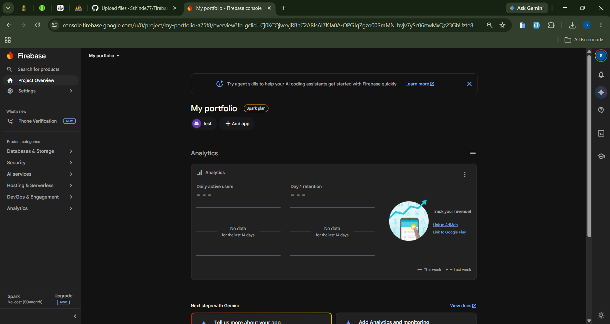
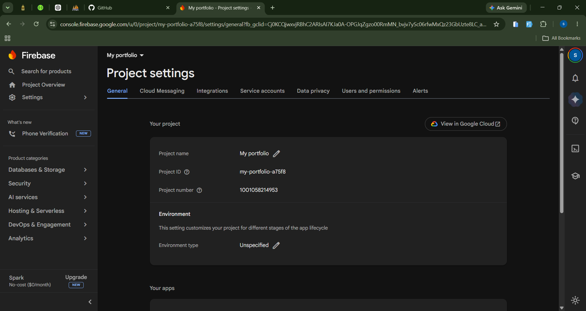
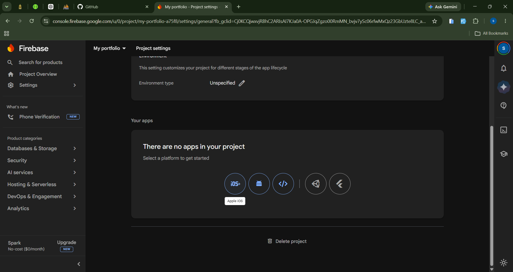
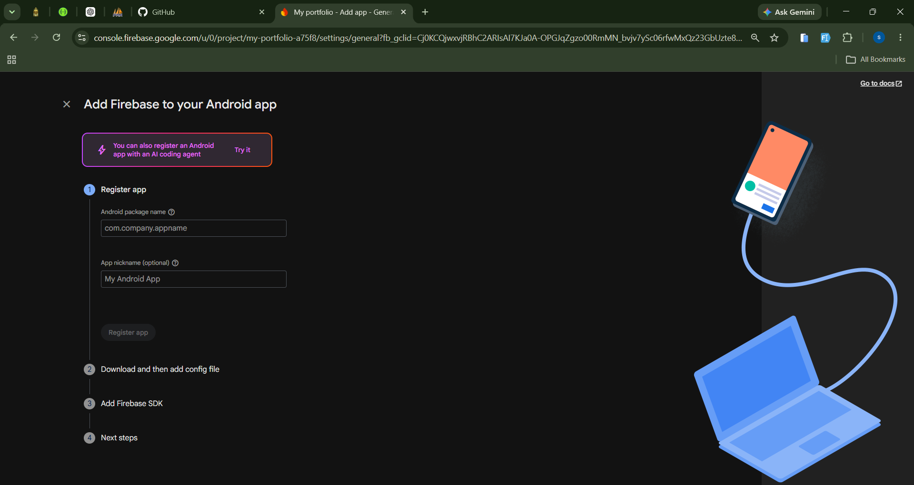
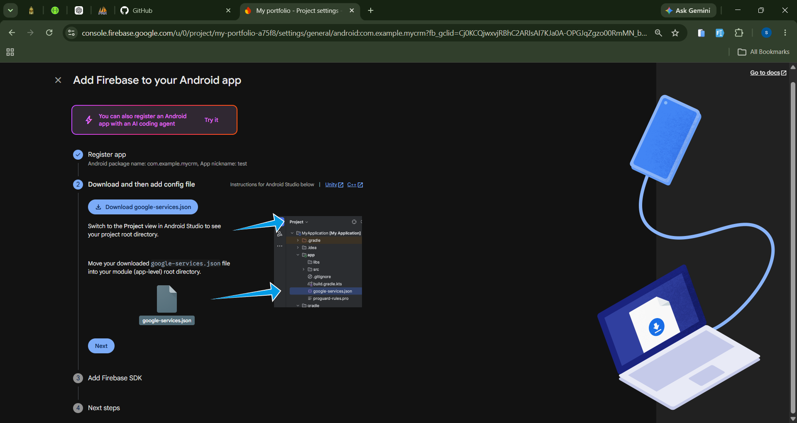
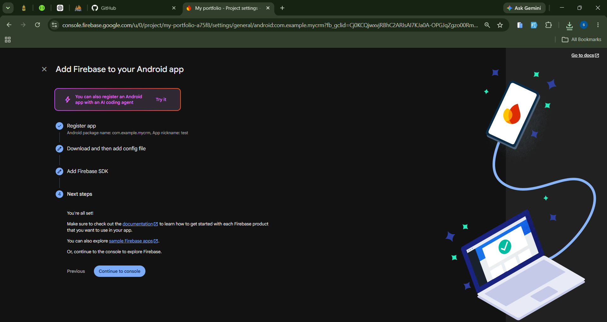

# Firebase Project Setup for Flutter Android

This guide explains how to create a Firebase project and connect it with your Flutter Android application. At the end of this guide, your Firebase project will be ready for Flutter integration.

---

# Prerequisites

Before starting, make sure you have:

- A Google Account
- Flutter SDK installed
- Android Studio installed
- An existing Flutter project

---

# Step 1: Open Firebase Console

Visit:

https://console.firebase.google.com/

Click

**Create a Project**

---

# Step 2: Create a Firebase Project

1. Enter your Project Name.
2. Click **Continue**.
3. Enable or disable Google Analytics.
4. Click **Create Project**.
5. Wait for the project to be created.

Example:



---

# Step 3: Open Project Settings

After creating the project,

Go to

Project Overview

↓

Project Settings

You should see a page similar to the following.



---

# Step 4: Add an Android Application

Scroll down to **Your Apps**.

Click the **Android** icon.



---

# Step 5: Register Android App

Enter the following information.

## Android Package Name

Example

```
com.example.myapp
```

This value **must exactly match** your Flutter project's package name.

You can find it in

```
android/app/build.gradle
```

or

```
android/app/build.gradle.kts
```

Search for

```
applicationId
```

Example

```gradle
applicationId "com.example.myapp"
```

---

## App Nickname

This field is optional.

Example

```
My Flutter App
```

---

## SHA-1 Certificate

Optional.

Required only for

- Google Sign-In
- Phone Authentication
- Dynamic Links

You can skip it for now.

After entering the information,

Click

**Register App**



---

# Step 6: Download google-services.json

Firebase will generate a file named

```
google-services.json
```

Click

**Download google-services.json**



---

# Step 7: Move google-services.json

Copy the downloaded file into

```
android/app/
```

The structure should look like this

```
android
│
└── app
    │
    ├── google-services.json
    ├── build.gradle
    └── src
```

Do not rename the file.

---

# Step 8: Complete Firebase Registration

Click

**Next**

until Firebase displays

**You're all set!**



Click

**Continue to Console**

---

# Firebase Project Setup Completed

At this stage, your Firebase project is connected to your Android application.

You now have:

- Firebase Project created
- Android App registered
- Package Name verified
- google-services.json downloaded
- Firebase connected to your Flutter project

---

# What's Next?

Proceed to **02-Flutter-Setup.md** to configure Flutter and install Firebase packages.
